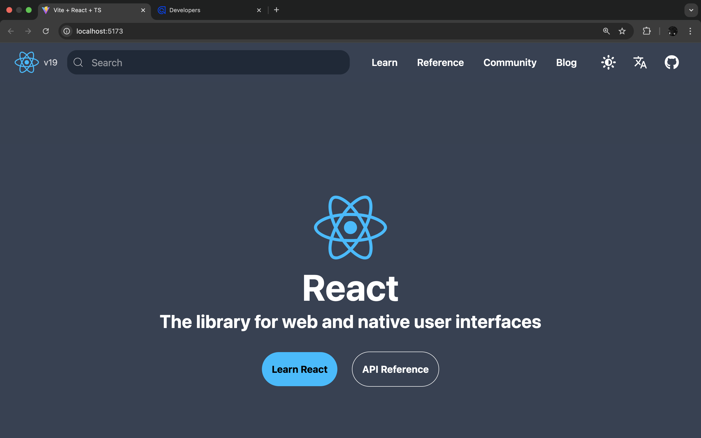
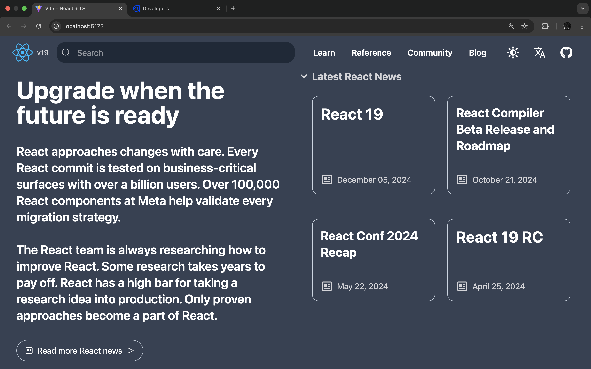
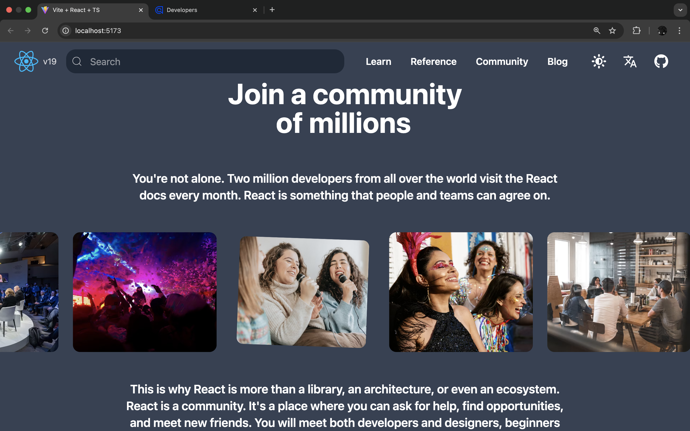
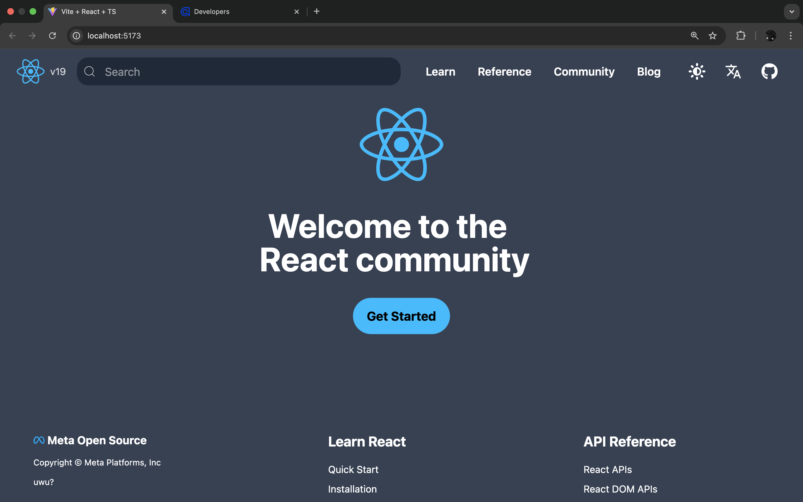
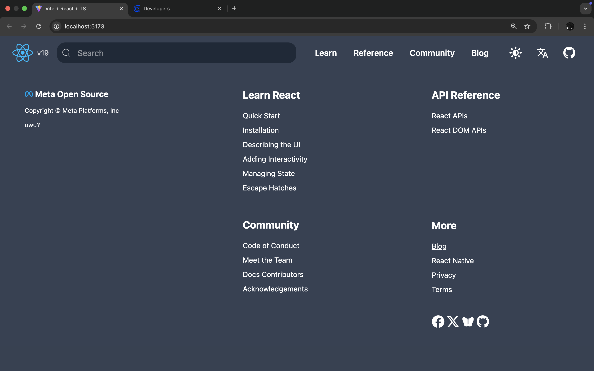

# React Replica App

A modern, high-performance React application built using **TypeScript, Vite, and Framer Motion**. This project replicates a sleek, interactive user experience while ensuring fast load times and smooth animations.

## 🚀 Features
- **TypeScript** for static typing and improved code maintainability
- **Vite** for blazing-fast development and build performance
- **Framer Motion** for fluid animations and transitions
- **Responsive Design** optimized for all screen sizes
- **Optimized Performance** with code splitting and lazy loading

## 📸 Screenshots
 



 

 

 


## 📦 Tech Stack
- **Frontend:** React, TypeScript
- **Build Tool:** Vite
- **Animations:** Framer Motion
- **Styling:** Tailwind CSS (if used)

## 🛠 Installation & Setup
1. **Clone the repository**
   ```sh
   git clone https://github.com/your-username/react-replica-app.git
   cd react-replica-app
   ```
2. **Install dependencies**
   ```sh
   npm install  # or yarn install
   ```
3. **Start the development server**
   ```sh
   npm run dev  # or yarn dev
   ```

## 📌 Deployment
To build and deploy the application, run:
```sh
npm run build  # or yarn build
```
Then, deploy the contents of the `dist` folder to any static hosting service (Netlify, Vercel, GitHub Pages, etc.).

## 📖 Contributing
Feel free to contribute by submitting pull requests or reporting issues. 


---
**Made with ❤️ using React, TypeScript & Vite**

